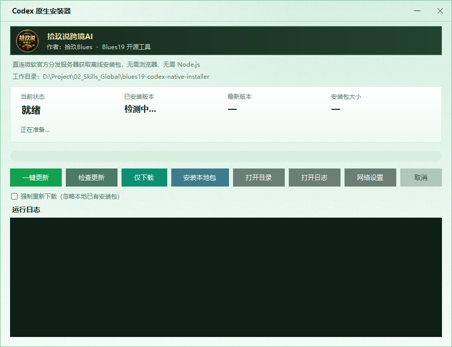
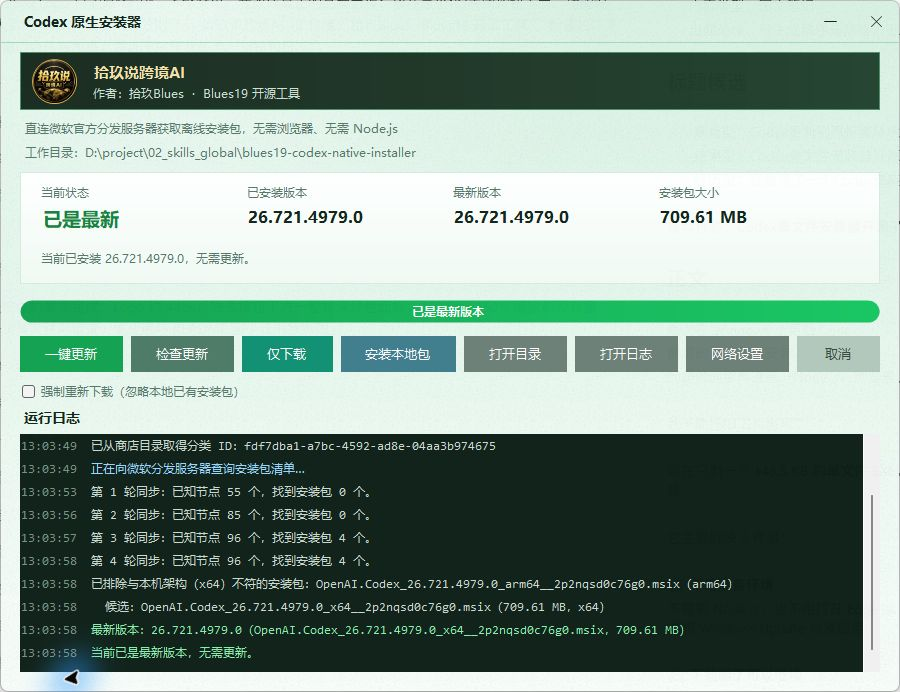

# Blues19 Codex 原生安装器

一个面向 Windows 的 Codex 桌面应用独立安装器。它直接从微软官方分发服务查询、下载并安装 Codex 的 MSIX 安装包，不需要浏览器自动化，也不需要另外安装 Node.js、npm、Visual Studio 或 .NET SDK。

当前版本：`2.0.0`

稳定下载文件名：`blues19-codex-native-installer.exe`。GitHub Release 发布资产可在文件名后追加版本号，例如 `blues19-codex-native-installer-v2.0.0.exe`。

## 出品与作者

- 公众号：**拾玖说跨境AI**
- 作者：**拾玖Blues**
- 项目标识：**Blues19**

公众号 Logo、名称与作者署名已嵌入窗口顶部的品牌面板和单文件 EXE，不需要额外携带图片文件。

## 界面预览



主界面从上到下分为四个区域：

1. **工作目录**：安装包、日志、状态文件和配置文件的实际保存位置。
2. **版本状态**：显示当前状态、已安装版本、微软服务器上的最新版本和安装包大小。
3. **操作区**：执行更新、检查、下载、安装和网络配置。
4. **运行日志**：实时显示当前步骤、重试、下载速度、校验和安装结果。

### 实际检查完成状态



上图是一次真实的“检查更新”完成结果：程序识别本机已安装版本，向微软分发服务同步安装包清单，过滤不匹配的架构，再显示最新版本、安装包大小和最终结论。图中的版本号仅代表截图时的结果，实际版本以运行时微软服务器返回为准。

## 中文环境支持

支持简体中文 Windows 环境。

- 界面、操作提示、错误说明、日志和配置注释均为中文。
- 源码构建时固定按 UTF-8 读取，避免在中文或非中文系统代码页下出现乱码。
- `settings.ini`、`install.log` 和 `status.json` 均使用 UTF-8。
- 界面优先使用 Windows 自带的“Microsoft YaHei UI”字体。
- 数字、版本、文件大小和时间等机器可读内容使用固定格式，不依赖区域设置。

已在 `zh-CN` 系统、活动代码页 936 下完成本机构建、启动冒烟检查和 150% DPI 中文界面渲染验证。

> 当前界面语言为中文，没有提供中英文切换。非中文 Windows 仍可构建和运行，但本项目当前主要面向中文用户。

## 功能

- 查询本机已安装的 Codex 版本和微软服务器上的最新版本。
- 一键完成“检查、下载、安装”。
- 只检查更新或只下载安装包。
- 安装目录中已有的 MSIX/MSIXBundle 包。
- 8 线程分块下载、断点续传、失败重试和下载进度显示。
- 按微软元数据校验文件大小和 SHA-1。
- 自动识别本机架构并过滤不兼容的安装包。
- 直接调用 Windows WinRT 部署接口安装；不可用时回退到 PowerShell。
- 检测 Codex 正在运行时，可选择关闭后安装或等待 Codex 退出后生效。
- 支持系统代理、自动探测本地代理、手动代理和强制直连。
- 记录运行日志、归档日志和供外部程序读取的 `status.json`。
- 同一工作目录只允许一个实例运行，避免分块文件和日志互相覆盖。

## 系统要求

- Windows 10 版本 2004（内部版本 19041）或更高版本，包括 Windows 11。
- Windows 自带的 .NET Framework 4.8。
- 可以访问微软商店目录、Windows Update 分发服务和微软下载 CDN。
- 安装到当前 Windows 用户，不要求管理员权限。

工具会根据系统架构选择可用包。最终是否提供相应架构的 Codex 安装包，以微软服务器返回结果为准。

## 快速开始

1. 下载仓库中的 `blues19-codex-native-installer.exe`。
2. 将它放到一个可写、路径较短的目录，例如 `D:\CodexInstaller`。
3. 双击运行。
4. 点击“一键更新”，或按需选择“检查更新”“仅下载”“安装本地包”。

默认启动后会自动检查更新。

### Windows SmartScreen 提示

当前 EXE 没有商业代码签名证书。从浏览器、邮件或聊天工具下载后，Windows 可能首次显示“Windows 已保护你的电脑”。

请只在确认文件来自可信仓库或自行从源码构建后运行。确认可信时，可点击“更多信息”再选择“仍要运行”。MSIX 在部署时仍会由 Windows 校验包签名。

## 界面操作

| 按钮或选项 | 什么时候使用 | 实际行为 | 会安装 Codex 吗 |
|---|---|---|---|
| 一键更新 | 日常更新时优先使用 | 依次检查版本；发现更新后获取直链、下载、校验并安装。已经是最新版时不会重复下载 | 有新版本时会 |
| 检查更新 | 只想确认版本，不想下载或安装 | 查询本机版本和微软服务器最新版本，更新顶部版本状态 | 不会 |
| 仅下载 | 需要准备离线安装包，或想稍后再安装 | 下载并校验最新安装包，保留在工作目录中，下载完成后停止 | 不会 |
| 安装本地包 | 已经下载好安装包，或在线查询暂时不可用 | 在工作目录中寻找可用的 MSIX/MSIXBundle，跳过查询和下载，直接调用系统部署接口 | 会 |
| 强制重新下载 | 怀疑本地完整包损坏，或希望重新取得同版本文件 | 一键更新或仅下载时不复用已有完整包，从微软 CDN 重新下载 | 取决于同时点击的主操作 |
| 打开目录 | 想找安装包、配置、日志或状态文件 | 在文件资源管理器中打开程序当前使用的工作目录 | 不会 |
| 打开日志 | 需要查看或分享本次运行的完整记录 | 使用系统默认文本程序打开 `install.log` | 不会 |
| 网络设置 | 检查正常但下载超时，或需要指定代理 | 打开代理设置窗口，可选择系统代理、自动探测、手动代理或强制直连 | 不会 |
| 取消 | 当前检查、下载或安装不应继续 | 向当前操作发送取消请求；已下载的分块会保留，之后可以断点续传 | 不会主动发起安装 |

### 推荐操作顺序

- **普通更新**：直接点击“一键更新”。
- **只确认是否有新版**：点击“检查更新”。
- **先下载，稍后安装**：点击“仅下载”，完成后再点击“安装本地包”。
- **网络不稳定**：先进入“网络设置”，选好代理后再执行“一键更新”或“仅下载”。
- **已有文件但想重新下载**：勾选“强制重新下载”，再点击“一键更新”或“仅下载”。

顶部状态区用于判断结果：

- “当前状态”显示正在检查、下载、安装、完成或失败。
- “已安装版本”来自当前 Windows 用户已注册的 Codex 包。
- “最新版本”和“安装包大小”来自微软分发服务。
- 下方进度条显示下载或安装进度；具体错误和重试原因以“运行日志”为准。

## 命令行参数

```text
blues19-codex-native-installer.exe
blues19-codex-native-installer.exe --update
blues19-codex-native-installer.exe --check
blues19-codex-native-installer.exe --download
blues19-codex-native-installer.exe --install-local
blues19-codex-native-installer.exe --help
```

| 参数 | 行为 |
|---|---|
| 无参数 | 打开界面并自动检查更新 |
| `--update` | 自动执行检查、下载和安装 |
| `--check` | 只检查更新 |
| `--download` | 只下载安装包 |
| `--install-local` | 直接安装工作目录中的已有安装包 |
| `--help` | 显示帮助 |

`--auto` 和 `--install` 是 `--update` 的别名；`--resume` 和 `--continue` 是 `--install-local` 的别名。

这是带界面的 Windows 程序。命令行参数用于选择启动后的自动操作，进度和结果仍会显示在窗口中。

## 工作目录和输出文件

程序优先把文件写到 EXE 所在目录。如果该目录不可写，例如位于 `Program Files`、只读介质或受限网络目录，会自动改用：

```text
%LOCALAPPDATA%\Blues19\CodexInstaller
```

主要文件：

| 文件 | 用途 |
|---|---|
| `OpenAI.Codex_<版本>_<架构>__2p2nqsd0c76g0.msix` | 下载的 Codex 安装包 |
| `install.log` | 本次运行日志，每次启动重新创建 |
| `logs\install-<时间>-<动作>-<结果>.log` | 退出时归档的历史日志，保留最近 100 份 |
| `status.json` | 当前或最后一次操作状态，便于外部脚本读取 |
| `settings.ini` | 代理模式和下载线程数 |
| `*.part*`、`*.partial` | 下载过程中的临时分块和合并文件 |

成功安装后，已下载的 MSIX 安装包会保留，方便离线安装或在其他电脑上复用。

### `status.json`

状态文件采用 UTF-8 JSON，主要字段包括：

| 字段 | 含义 |
|---|---|
| `appDir` | 当前工作目录 |
| `mode` | 启动动作 |
| `step` | 当前步骤 |
| `state` | `running`、`success`、`failed` 或 `cancelled` |
| `updatedAt` | 最后更新时间 |
| `message` | 中文状态说明 |
| `progress` | 下载或安装进度；不适用时为 `-1` |
| `packageName` | 安装包文件名 |
| `packageSize` | 格式化后的安装包大小 |
| `savePath` | 安装包保存路径 |

程序采用临时文件加替换的方式更新 `status.json`，减少外部程序读到半截 JSON 的概率。

## 网络和代理

默认跟随 Windows 系统代理。点击“网络设置”可以选择：

- 跟随系统代理；
- 自动探测常见本地代理端口；
- 手动填写代理，例如 `127.0.0.1:7897`；
- 强制直连。

自动探测会检查以下本地端口：

```text
7897, 7890, 10809, 10808, 1080, 8889, 8080, 2080, 33210
```

程序访问的核心服务包括：

- `displaycatalog.mp.microsoft.com`：查询 Codex 产品信息；
- `fe3.delivery.mp.microsoft.com` 和备用分发入口：查询 Windows Update 元数据；
- `dl.delivery.mp.microsoft.com` 等微软 CDN：下载安装包。

查询成功但下载超时时，通常是下载 CDN 的网络路径与查询接口不同。先在“网络设置”中切换代理模式，再重试下载。

## 工作原理

1. 使用 Codex 的 Microsoft Store 产品 ID 查询 DisplayCatalog，取得 Windows Update 分类 ID。
2. 向微软 FE3 分发服务申请匿名访问票据。
3. 调用 `SyncUpdates` 逐轮同步更新树，定位安装包元数据。
4. 按本机架构过滤候选包，并优先选择最新版本。
5. 调用 `GetExtendedUpdateInfo2` 换取有时效的微软 CDN 下载地址。
6. 分块下载并支持断点续传，完成后校验大小和 SHA-1。
7. 通过 `Windows.Management.Deployment.PackageManager` 部署到当前用户。
8. WinRT 部署接口不可用时，回退到 PowerShell 的 `Add-AppxPackage`。

## 安全与隐私

- 不要求 Microsoft 账号密码，也不会读取 Codex 登录凭据。
- 查询和下载使用微软产品目录、Windows Update 分发服务及微软 CDN。
- 安装包会进行大小和 SHA-1 校验，Windows 部署服务还会校验 MSIX 签名。
- 代理配置只保存在本机 `settings.ini`。
- 日志可能包含本机路径、版本、网络错误和安装结果；对外分享日志前请先检查内容。
- 本工具自身当前未做 EXE 代码签名，这是 SmartScreen 可能告警的原因。

## 常见问题

### 检查更新正常，但下载超时

打开“网络设置”，依次尝试“跟随系统代理”“自动探测本地代理”或手动填写代理。程序也会对微软 CDN 地址尝试兼容连接方式，但无法替代实际可用的网络链路。

### 提示 Codex 正在运行

Windows 无法立即替换正在使用的应用文件。可以选择关闭 Codex 后安装，或先铺设安装包，等 Codex 完全退出后让系统完成注册。关闭前请先保存正在编辑的内容。

### 安装失败并出现 `0x8007xxxx`

界面会为常见部署错误显示中文建议。完整 HRESULT、Windows 返回信息和 Activity ID 会写入 `install.log`，排查时以日志为准。

### 找不到下载好的文件

点击“打开目录”。当 EXE 所在目录不可写时，文件会保存到 `%LOCALAPPDATA%\Blues19\CodexInstaller`。

### 目录层级太深

尽管程序声明支持长路径，Windows 部署组件和临时分块仍可能受路径限制影响。建议把工具放到 `D:\CodexInstaller` 这类浅目录。

### 能否复制到另一台电脑

可以。在线使用时只需复制 `blues19-codex-native-installer.exe`；离线安装时还要复制已经下载的 MSIX/MSIXBundle 文件。目标电脑仍需满足系统版本和架构要求。

## 从源码构建

在 PowerShell 中进入项目目录后运行：

```powershell
powershell.exe -NoProfile -ExecutionPolicy Bypass -File .\build.ps1
```

构建脚本使用 Windows 自带的 C# 编译器：

```text
C:\Windows\Microsoft.NET\Framework64\v4.0.30319\csc.exe
```

如果 64 位编译器不存在，会尝试 32 位路径。构建过程不联网，也不需要 Visual Studio 或 .NET SDK。输出文件为：

```text
blues19-codex-native-installer.exe
```

源码固定兼容 C# 5。修改时不要使用字符串插值、空条件运算符、`nameof` 或表达式体成员等较新语法。

### 构建后验证

构建脚本会生成一个临时图标文件，调用新 EXE 的内部图标导出功能，确认可执行文件可以正常启动。

还可以离屏渲染界面，检查不同 DPI 下的布局：

```powershell
.\blues19-codex-native-installer.exe --render-ui .\ui-100.png 1.0
.\blues19-codex-native-installer.exe --render-ui .\ui-150.png 1.5
.\blues19-codex-native-installer.exe --render-ui .\ui-200.png 2.0
```

该参数只用于开发验证，不会安装或下载 Codex。

校验构建产物哈希：

```powershell
Get-FileHash .\blues19-codex-native-installer.exe -Algorithm SHA256
```

## 项目结构

```text
blues19-codex-native-installer\
├─ README.md
├─ SKILL.md
├─ build.ps1
├─ blues19-codex-native-installer.exe
└─ src\
   ├─ Program.cs
   ├─ MainForm.cs
   ├─ StoreApi.cs
   ├─ Fe3Client.cs
   ├─ Downloader.cs
   ├─ AppxInstaller.cs
   ├─ WinRtAppx.cs
   ├─ Settings.cs
   ├─ Logger.cs
   ├─ Models.cs
   ├─ Http.cs
   ├─ Util.cs
   ├─ ProgressPanel.cs
   ├─ Glass.cs
   ├─ IconFactory.cs
   ├─ AssemblyInfo.cs
   ├─ app.manifest
   └─ app.ico
```

## v2.0 相比旧版

| 项目 | 旧版 | v2.0 |
|---|---|---|
| 运行依赖 | Node.js、npm、Puppeteer、Edge/Chrome | Windows 自带组件 |
| 下载地址来源 | 第三方网页解析 | 微软 DisplayCatalog 和 Windows Update 分发服务 |
| 人机验证 | 可能遇到 Cloudflare | 不需要浏览器，不经过该步骤 |
| 安装方式 | 启动 PowerShell 调用 `Add-AppxPackage` | WinRT 部署优先，PowerShell 兜底 |
| 分发形态 | 多个批处理和脚本 | 单个 EXE |
| 错误反馈 | 依赖脚本输出 | 中文提示、HRESULT、Activity ID 和日志 |

## 已知限制

- EXE 当前没有代码签名证书，首次下载运行可能触发 SmartScreen。
- 工具依赖微软服务可用性，无法在完全离线且没有本地安装包时查询或下载。
- 当前界面只有中文。
- 微软接口、产品 ID、安装包命名或分发策略发生变化时，查询逻辑可能需要更新。
